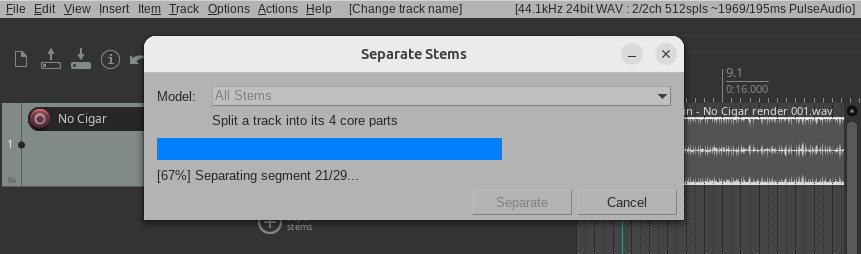

# REAPER Stem Separation Plugin

**Download:** [macOS](https://github.com/kn0ll/reaper-stem-separation-plugin/releases/latest/download/reaper-stem-separation-plugin-macos-arm64-cpu.tar.gz) | [Windows](https://github.com/kn0ll/reaper-stem-separation-plugin/releases/latest/download/reaper-stem-separation-plugin-windows-x64-cuda.zip) | [Linux](https://github.com/kn0ll/reaper-stem-separation-plugin/releases/latest/download/reaper-stem-separation-plugin-linux-x64-cuda.tar.gz)

Right click any audio item, click "Separate stems", and get individual tracks for vocals, drums, bass, guitar, piano, and more.



## Contents

- [Installation](#installation)
- [GPU Acceleration](#gpu-acceleration)
- [Models](#models)
- [Development](#development)
- [License](#license)

## Installation

Download the archive for your platform from the [latest release](https://github.com/kn0ll/reaper-stem-separation-plugin/releases/latest), extract it into your REAPER `UserPlugins` folder, and restart REAPER.

<details>
<summary>macOS</summary>

```bash
curl -fSL https://github.com/kn0ll/reaper-stem-separation-plugin/releases/latest/download/reaper-stem-separation-plugin-macos-arm64-cpu.tar.gz | tar xz -C ~/Library/Application\ Support/REAPER/UserPlugins/
```

</details>

<details>
<summary>Windows</summary>

```powershell
Invoke-WebRequest https://github.com/kn0ll/reaper-stem-separation-plugin/releases/latest/download/reaper-stem-separation-plugin-windows-x64-cuda.zip -OutFile $env:TEMP\rss.zip; Expand-Archive $env:TEMP\rss.zip "$env:APPDATA\REAPER\UserPlugins" -Force; Remove-Item $env:TEMP\rss.zip
```

</details>

<details>
<summary>Linux</summary>

```bash
curl -fSL https://github.com/kn0ll/reaper-stem-separation-plugin/releases/latest/download/reaper-stem-separation-plugin-linux-x64-cuda.tar.gz | tar xz -C ~/.config/REAPER/UserPlugins/
```

</details>

## GPU Acceleration

The plugin runs on CPU by default. For faster processing with an NVIDIA GPU, install the CUDA runtime for your platform.

<details>
<summary>macOS</summary>

GPU acceleration is not available on macOS. The plugin runs on CPU, which is still plenty fast for most tracks.

</details>

<details>
<summary>Windows</summary>

Install the [CUDA Toolkit](https://developer.nvidia.com/cuda-downloads) and [cuDNN](https://developer.nvidia.com/cudnn), then restart REAPER.

```powershell
# After installing both, verify with:
nvidia-smi
```

</details>

<details>
<summary>Linux</summary>

Install the [CUDA Toolkit](https://developer.nvidia.com/cuda-downloads) and [cuDNN](https://docs.nvidia.com/deeplearning/cudnn/installation/linux.html), then restart REAPER.

```bash
wget https://developer.download.nvidia.com/compute/cuda/repos/ubuntu2404/x86_64/cuda-keyring_1.1-1_all.deb
sudo dpkg -i cuda-keyring_1.1-1_all.deb
sudo apt-get update
sudo apt-get install cuda-toolkit-12 libcudnn9-cuda-12
```

</details>

## Models

| Label | Model | Stems | Use case |
|-------|-------|-------|----------|
| **Vocals (Best quality)** | [BS-RoFormer HyperACE](https://huggingface.co/pcunwa/BS-Roformer-HyperACE) | Vocals + Instrumental | Cleanest vocal isolation, highest fidelity |
| **Vocals (Fast)** | [MelBand-RoFormer](https://huggingface.co/KimberleyJSN/melbandroformer) | Vocals + Instrumental | Quick vocal isolation, great for previewing |
| **All Stems** | [HTDemucs](https://github.com/facebookresearch/demucs) | Drums, Bass, Other, Vocals | Full 4-stem separation, strong drum isolation |
| **All Stems + Guitar & Piano** | [HTDemucs 6s](https://github.com/facebookresearch/demucs) | Drums, Bass, Other, Vocals, Guitar, Piano | Guitar and piano as separate stems |

Models are downloaded automatically on first use, then cached `UserPlugins` for future use.

## Development

[](https://github.com/kn0ll/reaper-stem-separation-plugin/actions/workflows/build.yml)

### Devcontainer

The fastest way to get started. Open the included [devcontainer](https://containers.dev/supporting) in your preferred IDE, all build dependencies are pre-installed.

[](https://codespaces.new/kn0ll/reaper-stem-separation-plugin)

### Build From Source

Requires a C++20 compiler, CMake 3.18+, Ninja, Eigen3. Optionally requires [Docker](https://docs.docker.com/get-docker/) for model conversion.

<details>
<summary>macOS</summary>

```bash
brew install cmake ninja eigen

# Build the plugin and symlink to REAPER installation
make plugin
ln -sf "$(pwd)/build/reaper_stem_separation_plugin.dylib" ~/Library/Application\ Support/REAPER/UserPlugins/reaper_stem_separation_plugin.dylib

# Download ONNX Runtime and symlink to REAPER installation
make ort
mkdir -p ~/Library/Application\ Support/REAPER/UserPlugins/reaper-stem-separation-plugin
ln -sf $(pwd)/ort/*/lib/libonnxruntime* ~/Library/Application\ Support/REAPER/UserPlugins/reaper-stem-separation-plugin/

# Build the models and symlink to REAPER installation
make models
ln -sfn "$(pwd)/models" ~/Library/Application\ Support/REAPER/UserPlugins/reaper-stem-separation-plugin/models
```

</details>

<details>
<summary>Windows</summary>

Install [Visual Studio](https://visualstudio.microsoft.com/) (for MSVC), then from an elevated prompt:

```powershell
choco install cmake ninja make -y
```

Then from a **Developer Command Prompt**:

```powershell
make plugin
make ort

# Copy into REAPER installation
copy build\reaper_stem_separation_plugin.dll "$env:APPDATA\REAPER\UserPlugins\"
xcopy /E /I ort\onnxruntime-*\lib\onnxruntime*.dll "$env:APPDATA\REAPER\UserPlugins\reaper-stem-separation-plugin\"

# Build models (requires Docker)
make models
xcopy /E /I models "$env:APPDATA\REAPER\UserPlugins\reaper-stem-separation-plugin\models\"
```

</details>

<details>
<summary>Linux</summary>

```bash
sudo apt-get install cmake ninja-build libeigen3-dev

# Build the plugin and symlink to REAPER installation
make plugin
ln -sf "$(pwd)/build/reaper_stem_separation_plugin.so" ~/.config/REAPER/UserPlugins/reaper_stem_separation_plugin.so

# Download ONNX Runtime and symlink to REAPER installation
make ort
mkdir -p ~/.config/REAPER/UserPlugins/reaper-stem-separation-plugin
ln -sf $(pwd)/ort/*/lib/libonnxruntime* ~/.config/REAPER/UserPlugins/reaper-stem-separation-plugin/

# Build the models and symlink to REAPER installation
make models
ln -sfn "$(pwd)/models" ~/.config/REAPER/UserPlugins/reaper-stem-separation-plugin/models
```

</details>

## License

MIT License. See [LICENSE](LICENSE) for full license and third-party notices.
